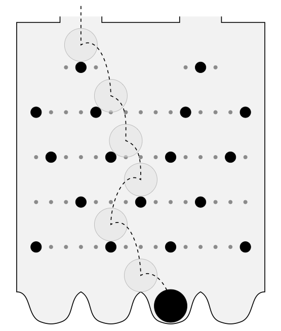

==================
The Waddington Box
==================

A Waddington box is a simulated mechanical version of Waddington's landscape
metaphor. The model is used in the publication `Causal Specificity and the Instructive-Permissive Distinction`__.

__ https://link.springer.com/article/10.1007/s10539-017-9568-0

.. Instructions
.. ----------------

.. TODO: 

.. Signaling: https://github.com/brettc/causalinfo/blob/master/notebooks/signaling.ipynb -->

.. Getting Started
    ---------------
    .. code:: bash 
    pip install causalinfo
    curl https://raw.githubusercontent.com/brettc/causalinfo/master/notebooks/introduction.ipynb 

Authorship
----------

All code was written by `Brett Calcott`_.

Acknowledgments
---------------

This work is part of the research project on the `Causal Foundations of
Biological Information`_ at the `University of Sydney`_, Australia. The work
was made possible through the support of a grant from the Templeton World
Charity Foundation. The opinions expressed are those of the author and do not
necessarily reflect the views of the Templeton World Charity Foundation. 

License
-------

MIT licensed. See the bundled LICENSE_ file for more details.

.. Miscellaneous Links------------

.. _LICENSE: https://github.com/brettc/waddington-box/blob/master/LICENSE

.. _`Brett Calcott`: http://brettcalcott.com

.. _`University of Sydney`: http://sydney.edu.au/ 

.. _`Causal Foundations of Biological Information`: http://sydney.edu.au/foundations_of_science/research/causal_foundations_biological_information.shtml 

.. vim: fo=tcroqn tw=78
